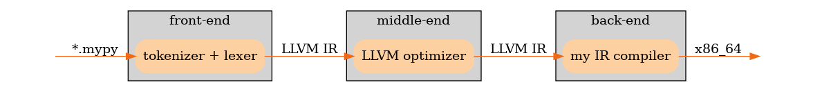
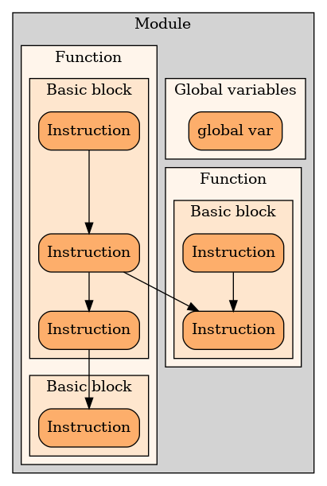

# Cоздание компилятора языка программирования *mypy* под AMD x86_64

### Цель работы: 

- Создать нативный компилятор языка  *mypy*.
- Сравнить скорости исполнения программы после компиляции в x86_64 и после трансляции в байт-код [процессора](https://github.com/egorSharapov/Processor).
- Протестировать корректность скомпилированной программмы.

## Глава 1. Введение

Рассмотрим общую структуру компиляторов:

1. Лексический анализ. На этом этапе последовательность символов исходного файла преобразуется в последовательность лексем. Лексемой называется неделимая смысловая единица языка.
Для примера, исходный код строки программы...

```C
var x = (y — z);
```
...может быть преобразован в следующий поток лексем:

```
оператор `var`
имя "х" 
оператор `=` 
оператор `(` 
имя "y" 
оператор `-` 
имя "z" 
оператор `)` 
оператор `;` 
```

2. Синтаксический (грамматический) анализ. Последовательность лексем преобразуется в древо разбора.

3. Cемантический анализ. На этой фазе древо разбора обрабатывается с целью установления его семантики (смысла) — например, привязка идентификаторов к их объявлениям, типам данных, проверка совместимости, определение типов выражений и т. д. Результат обычно называется «промежуточным представлением/кодом», и может быть дополненным древом разбора, новым деревом, абстрактным набором команд или чем-то ещё, удобным для дальнейшей обработки.
3. Оптимизация. Выполняется удаление излишних конструкций и упрощение кода с сохранением его смысла. Оптимизация может быть на разных уровнях и этапах — например, над промежуточным кодом или над конечным машинным кодом.
4. Генерация кода. Из промежуточного представления порождается код на целевом машинно-ориентированном языке.

В нашем компиляторе будем придерживаться такой структуры: 

 

## Глава 2. Немного об SSA-форме
### Определение 

>SSA (англ. Static single assignment form) — промежуточное представление, в котором каждой переменной значение присваивается лишь единожды. Переменные исходной программы разбиваются на версии, обычно с помощью добавления суффикса, таким образом, что каждое присваивание осуществляется уникальной версии переменной. 

### Перевод в SSA
Перевод обычного программного кода в SSA-представление достигается путём замены в каждой операции присваивания переменной из левой части на новую переменную. Для каждого использования значения переменной исходное имя заменяется на имя *версии*, соответствующей нужному базовому блоку. Рассмотрим следующий фрагмент кода:

*.mypy
```py
var a = 5
var b = 10
if b != 0:
    a = a/b
```
Мы видим, что в фрагменте кода 3 раза используется значение *a* и 2 раза значение *b*. Поэтому нам создать 5 уникальных версий этих переменных, что мы и можем увидеть в нижеприведенном листинге LLVM IR:

Переменной *a* соотвествуют виртуальные регистры: `%0`, `%4`.

Переменной *b* соотвествуют виртуальные регистры: `%1`, `%2`, `%5`.

```x86asm
entry:
  %0 = alloca i64, align 8
  store i64 500, i64* %0, align 4
  %1 = alloca i64, align 8
  store i64 1000, i64* %1, align 4
  br label %if

if:                                               ; preds = %entry
  %2 = load i64, i64* %1, align 4
  %3 = icmp ne i64 %2, 0
  br i1 %3, label %then, label %next

then:                                             ; preds = %if
  %4 = load i64, i64* %0, align 4
  %5 = load i64, i64* %1, align 4
  %6 = sdiv i64 %4, %5
  store i64 %6, i64* %0, align 4
  br label %next
```
Подробнее об LLVM IR в следующей главе

## Глава 3. LLVM IR

Основные особенности 
* Представлен в SSA форме
* Имеет бесконечное число виртуальных регистров
* Используются трехоперандные команды 

LLVM IR это одна из форм промежуточного представления кода.

Программа состоит из модуля, который в свою очередь включает в себя прототипы функций. Функции состоят из базовых блоков, каждый базовый блок заканчивается инструкций перехода на следующий базовый блок, В теле блока (кроме последней команды) нет условных команд перехода. Т.е. код каждого блока исполняется от начала до конца в любом случае.




Существует два варианта представления `LLVM IR`
- *.ll - текстовый файл байткода 
- *.bc - бинарное представление байткода `LLVM`

Фронтенд генерирует два файла `.ll` (для отладки) и `.bc` (для использования на следующих ступенях компиляции)

Здесь и далее в примерах будут приведены части `.ll` файлов для простоты понимания.
Во фронтенде языка используется модуль `llvm::IRBuilder`, представляющий удобное `API`  для написания генератора `IR` кода.

### Пример разбора выражения (переменные где-то уже определены)
test.mypy
```py
var z = 10 * x + y / 5;
```
test.ll
```x86asm
%z = alloca i64, align 8              ; Аллоцирование переменной
%1 = load i64, i64* %x, align 8       ; Загрузка значения переменной в виртуальный регистр
%2 = mul i64 1000, %1                 ; Умножение с сохранением результата во временном регистре
%3 = load i64, i64* %y, align 8       ; Загрузка значения переменной в виртуальный регистр
%4 = sdiv i64 %3, 1000                ; Знаковое деление
%5 = add i64 %2, %4                   ; Сложение
store i64 %5, i64* %z, align 8        ; Сохранение значения временного регистра в переменной
```
Для чтения *.bc файлов используется С-api llvm

## Глава 4. О соглашениях

Компилятор придерживается декларации о вызове `fastcall`, при которой аргументы функции кладутся в регистры. Возвращаемое значение передается через регистр `rax`.

Локальные переменные внутри функции хранятся в памяти. Регистр `r8` используется для индексации по локальным переменным.

## Глава 5. Эвристика (оптимизация) распределения виртуальных регистров по реальным
При трансляции нашей текстовой программы в `LLVM IR`, мы не ориентировались на особенности целевой платформы и считали, что число регистров неогранично. К сожалению, суровая реальность состоит о том, что в процессоре конечное число регистров. Поэтому при компиляции LLVM IR в x86_64 возникает проблема распределения виртуальных регистров по реальным.


Для оптимального распределения по регистрам используется fixup-таблица, где каждому значению `LLVMValueRef` соответствует реальный регистр.
```c
typedef struct 
{
    LLVMValueRef value;
    enum Regs reg;
    size_t uses;
} Fixup_node;
```
Каждой инструкции `IR` присваевается свой реальный регистр, затем инструкция компилируется в нативный код.

Рассмотрим компиляцию `IR` в нативный код на данном выражении:

test.mypy
```py
x += 10
y -= 5
```

Также напомню, что в нашем языке все числа представлены типом `int64` фиксированной точности, поэтому число   `10.23` будет транслировано в `1023`

test.ll 
```x86asm
%0 = load i64, i64* %x  (1)
%1 = add %0, 1000       (2)
store i64 %1, i64* %x   (3)

%2 =  load i64, i64* %y (4)
%3 = sub %2, 500        (5)
store i64 %3, i64* %x   (6)
```

На первый взгляд кажется, что нам необходимо 3 реальных регистра для вычислений. Но, присмотревшись повнимательнее к строке  (2), увидим, что можно заменить регистр `%0` и `%1` на один реальный, так как значение %0 больше нигде не используется. Например:  `add rax, 1000`.

Также очевидно, что после инструкции store ((3) строка) нам уже не нужно значение в регистре `%1`, поэтому теперь можно использовать реальный регистр, соотвествующий `%1` в других выражениях.

Теперь посмотрим на дизаассемблированный код примера. 

test.out

```x86asm
mov rbx, [r8+8]
add rbx, 1000
mov [r8+8], rbx

mov rbx, [r8]
sub rbx, 500
mov [r8], rbx
```

Как видим, компилятор не использовал на каждый виртуальный регистр уникальный реальный
Вместо этого регистр `rbx` был переиспользован.

## Глава 6. Unit-тестирование и замеры скорости исполнения
Тестирование будет проводиться на двух программах:
- Решение квадратных уравнений с разбором частных случаев.
- Рекурсивное вычисление факториала числа.

|Программа|Аргументы|Время исполнения (_my_cpu_), мкс |Время исполнения (*AMD64*), мкс|
| ------------   | ------------    | -----------------            | ----------------- |
| qsolver.mypy   | 1.00 -6.00 8.00 |       4531                   |      1325         |
| factorial.mypy | 3               |       1347                    |       303         |


| Исполнитель   | Программа      |  Вход              | Результат |  Ожидаемый результат | 
| -----------   | :-------------:| :---------------: | :-------:  | :------------------: | 
| *AMD64* | factorial.mypy |  3                 |    6.00   |        6             |
|               | factorial.mypy |  -1                |    1.00   |        1             |
|               | qsolver.mypy   |  0.00 0.00 0.00    |    -1     |         -1           | 
|               | qsolver.mypy   |  1.00 -6.00 8.00   |2 4.00 2.00|      2 4 2           | 

<details>
    <summary>factorial.mypy</summary>

```py
func factorial (var num):
    if num > 0:
        return num * factorial (num - 1)
    
    return 1


func main ():
    var x = input ()
    x = factorial (x)
    print (x)
    return 0
```
</details>


<details>
    <summary>qsolver.mypy</summary>
    
```py
func linear (var b, var a):
    print (1)
    print ( -b / a)
    return 0

func qsolver (var a, var b, var c):
    var D = b*b - 4*a*c
    if a == 0:
        if b == 0:
            if c == 0:
                print (-1) 
            else:
                print (0)
            
        else:
            var z = linear (c, b)
        
    if D < 0:
        print (-1)
    else:
        D = sqrt (D)
        print (2)
        print ((D - b) / (2*a))
        print (- (D + b) / (2*a))
    return 0


func main ():
    var a = input ()
    var b = input ()
    var c = input ()
    var z = qsolver (a, b, c)
    return 0
```
</details>


## Заключение

- По итогам работы был создан компилятор языка.
- Были проведены замеры скорости исполнения, которые показали что компилятор создает более оптимизированный код, чем предыдущая версия транслятора в байт-код *my_cpu*.
- Unit-тесты проверили, что компиляция корректна.


## Источники вдохновения

1. http://stolyarov.info/
2. https://habr.com/ru/articles/119850/
3. https://llvm.org/
4. https://habr.com/ru/articles/99595/
